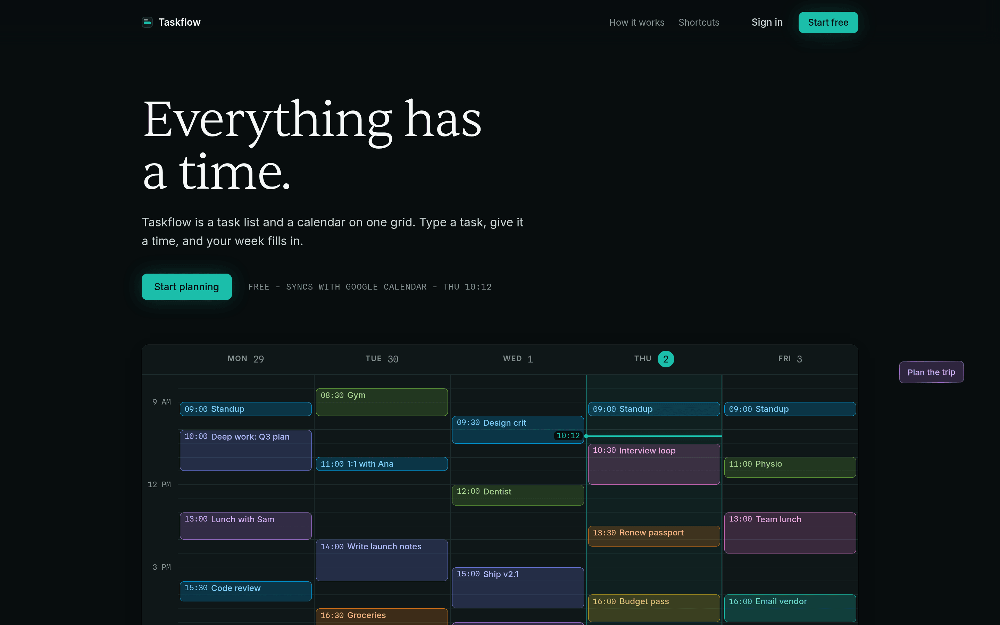

<p align="center">
  
  
</p>

<p align="center">
  <strong>A full-stack calendar and task manager: natural-language input, four calendar views, a kanban board, and two-way Google Calendar sync.</strong>
</p>

<p align="center">
  <a href="https://taskflow-calendar.vercel.app">Live</a> ·
  <a href="#features">Features</a> ·
  <a href="#architecture">Architecture</a> ·
  <a href="#testing">Testing</a> ·
  <a href="#getting-started">Getting Started</a>
</p>

---

<p align="center">
  <a href="https://github.com/ShreeChaturvedi/taskflow-calendar/actions/workflows/ci.yml"></a>
  
  
  
  
</p>

<p align="center">
  <a href="https://taskflow-calendar.vercel.app">
    
  </a>
</p>
<p align="center"><sub>The landing page, live at taskflow-calendar.vercel.app.</sub></p>

## Overview

Taskflow Calendar is a task manager and a calendar that are the same object: type a task in plain words and it lands on the calendar. Type "Email vendor about invoice friday 4pm urgent" and the smart input pulls out the date, time, and priority as you go, no date picker required. The app ships as one Vercel project: an Astro landing page, a React SPA, exactly two serverless functions, and Postgres. It syncs both ways with Google Calendar, so an edit made in either place shows up in both.

## Features

<table>
<tr>
<td>
  
  
</td>
<td>
  <strong>Calendar</strong><br>
  Month, week, day, and list views. Drag to move an event, drag to resize it, or drag a task from the list onto the grid to schedule it.
</td>
</tr>
<tr>
<td>
  <strong>Smart input</strong><br>
  Chrono-node and compromise parse dates ("next friday 4pm"), priorities ("urgent"), and people out of plain text as you type. Matched spans underline live.
</td>
<td>
  
  
</td>
</tr>
<tr>
<td>
  
  
</td>
<td>
  <strong>Kanban</strong><br>
  A per-list board with drag-and-drop between status columns (dnd-kit). Each task list switches between folder, list, and board views.
</td>
</tr>
<tr>
<td>
  <strong>Command bar</strong><br>
  Cmd+K opens a command palette from anywhere in the app. Single-key shortcuts jump straight to a view or action:<br><br>
  <code>Cmd+K</code> command palette<br>
  <code>T</code> today<br>
  <code>D</code> <code>W</code> <code>M</code> <code>L</code> switch view<br>
  <code>N</code> new task<br>
  <code>Cmd+P</code> profile<br>
  <code>Cmd+,</code> settings
</td>
<td>
  
  
</td>
</tr>
<tr>
<td>
  
  
</td>
<td>
  <strong>Google Calendar sync</strong><br>
  Two-way sync, connected from Settings → Integrations. Push webhooks and a reconcile job keep both sides converged.
</td>
</tr>
<tr>
<td>
  <strong>Folders and tags</strong><br>
  Every task list has a color. That chip repeats across list rows, board cards, and calendar events, so a list stays recognizable everywhere it appears.
</td>
<td>
  
  
</td>
</tr>
</table>

### Also in the box

- Recurring events with RRULE, per-occurrence exceptions, and per-event colors
- Conflict detection across calendars when scheduling
- Attachments on tasks: upload, with image and PDF preview in place
- Settings: profile, preferences, data export (JSON download), account deletion
- Refresh-token rotation, Google sign-in, and password reset by email
- Light and dark themes, responsive down to phone widths

## Architecture

<p align="center">
  
  
</p>

- **Frontend**: Vite 5, React 19, TypeScript 5.8, Tailwind CSS v4, Radix/shadcn primitives. Zustand for client state, TanStack Query for server state with optimistic updates and rollback.
- **API**: Two Vercel functions. `api/[...route].ts` dispatches 38 routes to one handler per endpoint in `api/_handlers/`, each behind the same middleware chain (CORS, request ID, rate limiting, JWT auth, Zod validation). `api/google/[...route].ts` handles Calendar sync: 8 routes, including the webhook receiver and a daily `cron/renew` cron.
- **Database**: Plain SQL over `pg`, no ORM. 10 migrations in `lib/config/migrations/`, applied transactionally by `npm run db:migrate`, recorded in `schema_migrations`.
- **Files and email**: Vercel Blob for attachments, Resend for password-reset mail.
- **CI**: GitHub Actions, three jobs. `checks` runs lint, typecheck, the no-DB suites, and both builds. `backend-db` boots Postgres 16, runs migrations, then the real-database suites (backend workspace, L2, L3, Google sync). `e2e` boots the full stack and runs Playwright in parallel. A separate scheduled workflow reconciles production sync every 15 minutes.

<details>
<summary><strong>How Google sync works</strong></summary>

<p align="center">
  
  
</p>

A watch channel pushes a webhook notification on every remote change, which triggers an incremental pull. If Google returns HTTP 410, sync falls back to a full resync. Local edits queue in an outbox and drain to Google, and both sides converge through a per-field three-way merge, so a local edit and a remote edit to different fields on the same event both survive. The watch channel renews daily, and a GitHub Actions workflow reconciles every connected account every 15 minutes as a backstop.

</details>

### Performance

The entry chunk is 72 KB gzip. FullCalendar, the NLP parser, the emoji picker, and the PDF viewer are code-split and lazy-loaded, so each loads only when a user reaches that feature. Fonts are self-hosted, 133 KB across four woff2 files.

## Testing

| Layer                | What it exercises                                                                                                                          | Command                                         | Tests |
| -------------------- | ------------------------------------------------------------------------------------------------------------------------------------------ | ----------------------------------------------- | ----- |
| L1 frontend          | components, hooks, stores, the smart-input parsers (chrono, compromise, priority)                                                          | `npm run test:frontend:run`                     | 826   |
| L1 backend           | services and middleware with the DB mocked, router dispatch tables                                                                         | `npm run test:backend:run`                      | 636   |
| Shared               | Zod schemas and utilities used by both sides                                                                                               | `npm run test:run --workspace=packages/shared`  | 22    |
| L2 services          | TaskService, EventService, TaskListService, and cross-user IDOR checks against a real Postgres                                             | `npm run test:l2`                               | 80    |
| L3 handler contracts | the actual `api/[...route].ts` and `api/google/[...route].ts` dispatchers mounted on an Express adapter: real routing, middleware, and SQL | `npm run test:l3:run`                           | 107   |
| Google sync          | the sync engine (channels, outbound writes, merge) against a real Postgres with a fake Google client                                       | gated on `GOOGLE_SYNC_TEST_DB_URL`              | 33    |
| Backend workspace    | auth SQL round-trips, refresh-token rotation, schema and access-control checks                                                             | `npm run test:run --workspace=packages/backend` | 89    |
| L5 browser E2E       | signup, login, reset-password round trip, task and event CRUD, recurrence, kanban drag, settings, all driven through a real Chromium       | `npm run test:e2e`                              | 21    |

Total: 1,814 cases. The frontend layer includes the L4 optimistic-update suites, which assert the TanStack Query cache rolls back when a mutation fails, and L5 drives the built app through a real Chromium browser against a real backend and database. The real-database layers gate on env vars (`L2_TEST_DATABASE_URL`, `L3_DATABASE_URL`, `GOOGLE_SYNC_TEST_DB_URL`) and skip cleanly when unset, so `npm run test:backend:run` passes without a database. CI provides the databases: `backend-db` runs L2, L3, sync, and the backend workspace suite, and a separate `e2e` job runs Playwright in parallel so it never slows the fast checks.

## Getting Started

Prerequisites: Node 22 and Docker.

```bash
git clone https://github.com/ShreeChaturvedi/taskflow-calendar.git
cd taskflow-calendar
npm install
docker compose up -d postgres
npm run db:migrate
npm run dev
```

`npm run dev` starts the Vite dev server and a local Express API together. The app is at `http://localhost:5180/app` and the API at `http://localhost:3001` (Vite proxies `/api` to it). No env file is required for this flow: the dev API and the migration runner both default to the Docker Postgres URL.

The landing page is its own workspace: `npm run dev:landing`.

### Optional environment variables

Copy `.env.example` to `.env.local` and fill in what you need:

- `GOOGLE_CLIENT_ID`, `GOOGLE_CLIENT_SECRET`, `VITE_GOOGLE_CLIENT_ID` for Google sign-in and Calendar sync
- `RESEND_API_KEY`, `FROM_EMAIL` for password-reset email
- `BLOB_READ_WRITE_TOKEN` for file attachments

### Scripts

| Command                                          | Description                                         |
| ------------------------------------------------ | --------------------------------------------------- |
| `npm run dev`                                    | Vite (5180) plus the local API (3001)               |
| `npm run build`                                  | shared package, landing, SPA, and backend, in order |
| `npm run db:migrate`                             | apply pending SQL migrations, transactionally       |
| `npm run test:frontend:run` / `test:backend:run` | the no-DB suites                                    |
| `npm run lint`                                   | ESLint across the repo                              |

The rest of the scripts, including the real-database suites, individual builds, and Docker helpers, are in `package.json`.

### Deploying

One Vercel project. `vercel.json` chains the build (shared, then landing into `dist/`, then the SPA into `dist/app`), declares the two functions, the daily channel-renewal cron, and the `/app` rewrites. Set `DATABASE_URL` (Neon), `JWT_SECRET`, and whichever optional keys above you use.

<details>
<summary><strong>Project structure</strong></summary>

```
taskflow-calendar/
├── src/                      # React SPA, served at /app
│   ├── components/           # calendar, tasks, kanban, smart-input, dialogs, ui
│   ├── hooks/                # TanStack Query hooks, shortcuts, Google sync
│   └── stores/               # Zustand stores
├── landing/                  # Astro landing page, served at /
├── api/
│   ├── [...route].ts         # catch-all Vercel function: 38 routes
│   ├── google/[...route].ts  # second function: Calendar sync, webhook, cron
│   └── _handlers/            # one handler file per endpoint
├── lib/                      # services, middleware, Google sync engine
│   └── config/migrations/    # 10 plain-SQL migrations
├── packages/
│   ├── shared/               # types and Zod schemas shared by both sides
│   └── backend/              # auth services (JWT, refresh rotation, OAuth)
├── test/l3/                  # L3 handler-contract suite (Express adapter)
├── scripts/                  # dev API server, migration runner
└── .github/workflows/        # CI and the sync reconcile cron
```

</details>

## Contributing & License

MIT, see [LICENSE](LICENSE). Read [CONTRIBUTING.md](CONTRIBUTING.md) before opening a PR.

Built by [Shree Chaturvedi](https://github.com/ShreeChaturvedi).
