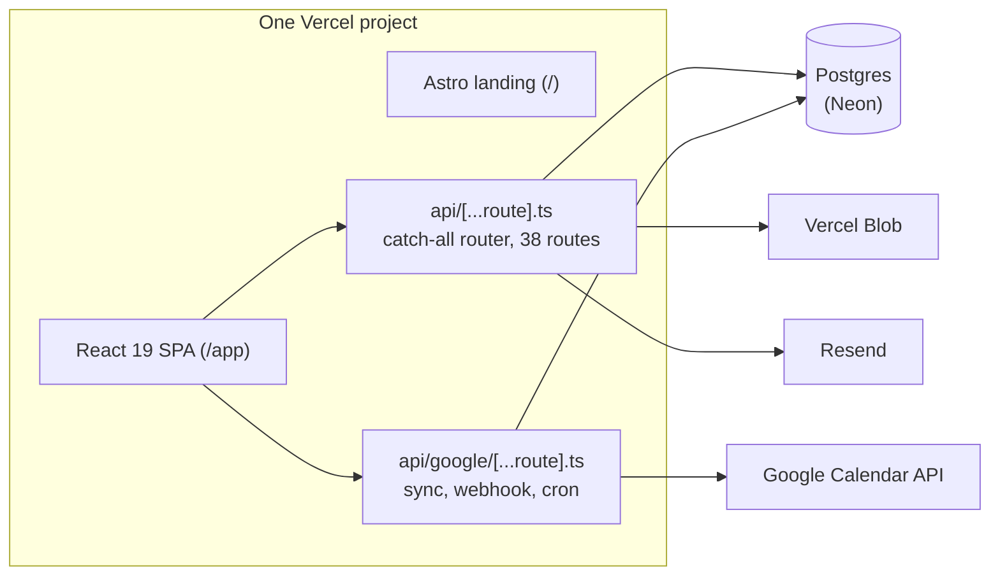
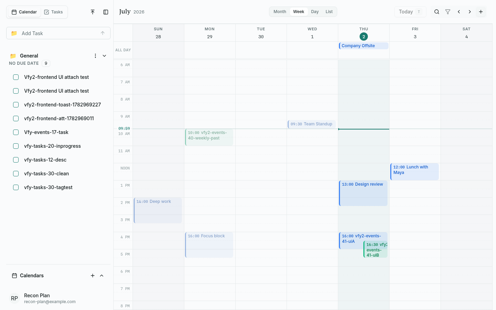
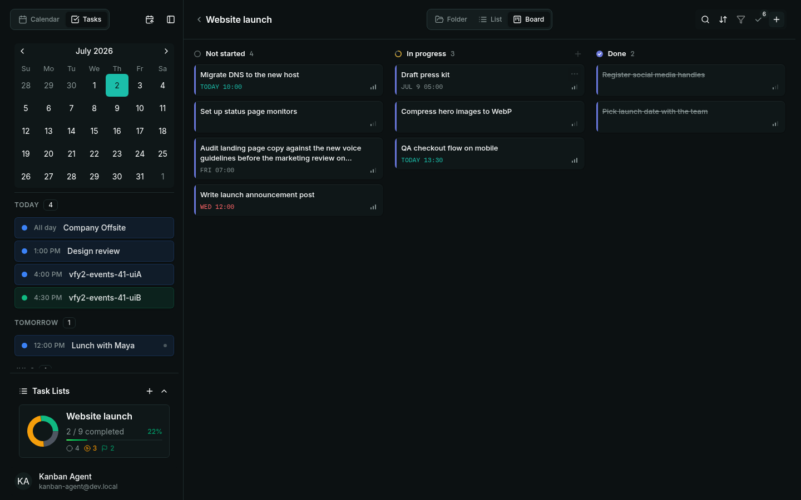
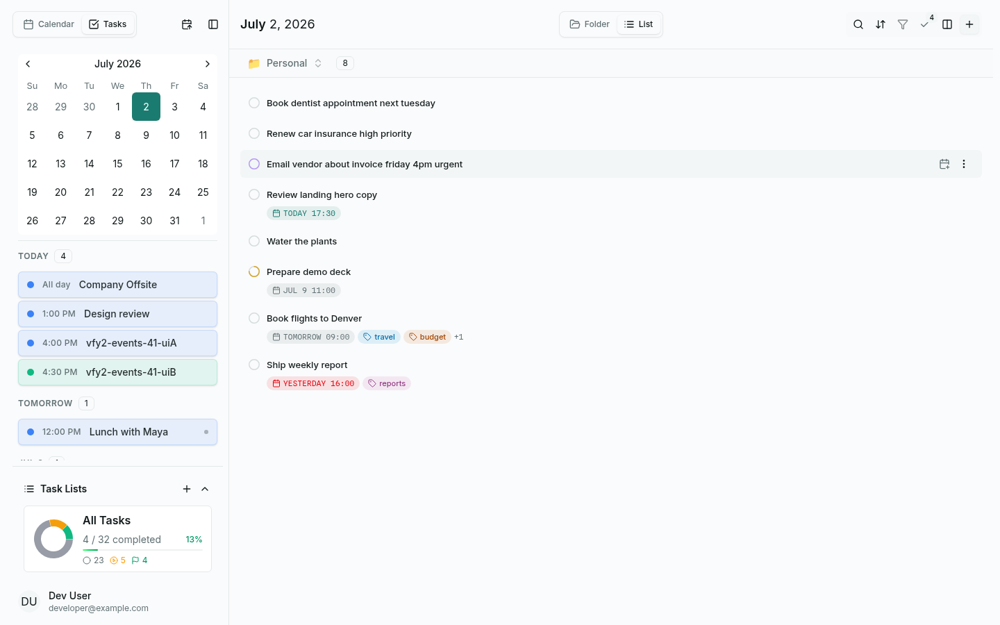

<p align="center">
  
  
</p>

<h1 align="center">Taskflow Calendar</h1>

<p align="center">
  <strong>A full-stack calendar and task manager: natural-language input, four calendar views, a kanban board, and two-way Google Calendar sync.</strong>
</p>

<p align="center">
  <a href="#features">Features</a> •
  <a href="#architecture">Architecture</a> •
  <a href="#testing">Testing</a> •
  <a href="#getting-started">Getting Started</a> •
  <a href="#screenshots">Screenshots</a>
</p>

<p align="center">
  <a href="https://github.com/ShreeChaturvedi/taskflow-calendar/actions/workflows/ci.yml"></a>
  
  
  
  
</p>

---

## Overview

Taskflow Calendar ships as one Vercel project: an Astro landing page at `/` and a Vite + React 19 SPA at `/app`, backed by exactly two serverless functions and a Postgres database (Neon in production, Docker locally). Type "Email vendor about invoice friday 4pm urgent" and the smart input extracts the date, time, and priority as you type.

- **Two-way Google Calendar sync.** Push notifications via watch channels, incremental pull with full resync on HTTP 410, an outbox for local edits, a 15-minute reconcile workflow, and daily channel renewal.
- **1,814 tests across eight suites**, from pure parser units to handler contract tests that exercise the real router against a real Postgres. Counts and commands in [Testing](#testing).
- **Two serverless functions total** (fits the Vercel Hobby limit): a catch-all router dispatching 38 routes, plus a second function for Google sync.
- **Keyboard-first.** Cmd+K command bar, single-key navigation (T today, D/W/M/L views, N new task).

## Features

- **Calendar**: month, week, day, and list views (FullCalendar), drag and resize events, drag tasks from the list onto the grid to schedule them
- **Smart input**: a chrono-node + compromise parsing pipeline pulls dates ("next friday 4pm"), priorities ("urgent"), and people out of plain text as you type
- **Recurring events**: RRULE patterns with per-occurrence exceptions and per-event colors
- **Kanban board**: drag cards between status columns, per-list board/list/folder views
- **Conflict detection**: overlap checks across calendars when scheduling
- **Attachments**: upload files to tasks (Vercel Blob), preview images and PDFs in place
- **Settings**: profile, preferences, data export, account deletion
- **Auth**: email/password with refresh-token rotation, Google sign-in, password reset by email (Resend)
- **Themes**: light and dark, responsive down to phone widths

## Architecture



- **Frontend**: Vite 5, React 19, TypeScript 5.8, Tailwind CSS v4 with Radix UI / shadcn primitives. Zustand holds client state, TanStack Query holds server state with optimistic updates and rollback.
- **API**: two Vercel functions. `api/[...route].ts` matches 38 routes and dispatches to one handler file per endpoint in `api/_handlers/`, each wrapped in the same middleware chain (CORS, request ID, rate limiting, JWT auth, Zod validation). `api/google/[...route].ts` is a separate function for Calendar sync: 8 routes including the webhook receiver and a daily `cron/renew` Vercel cron.
- **Database**: plain SQL over the `pg` driver, no ORM. 10 migrations in `lib/config/migrations/`, applied transactionally by `npm run db:migrate` and recorded in `schema_migrations`.
- **Files and email**: Vercel Blob stores attachments, Resend sends password-reset mail.
- **CI**: GitHub Actions with three jobs. `checks` runs lint, typecheck, the no-DB test suites, and both builds. `backend-db` boots a Postgres 16 service, runs the migrations, then runs the real-database suites (backend workspace, L2, L3, Google sync). `e2e` boots the full stack and runs the Playwright browser suite in parallel. A separate scheduled workflow triggers the production sync reconcile every 15 minutes.

## Testing

The suite is layered: pure units at the bottom, real infrastructure toward the top. Every number below is from a full run of this tree.

| Layer                | What it exercises                                                                                                                          | Command                                         | Tests |
| -------------------- | ------------------------------------------------------------------------------------------------------------------------------------------ | ----------------------------------------------- | ----- |
| L1 frontend          | components, hooks, stores, the smart-input parsers (chrono, compromise, priority)                                                          | `npm run test:frontend:run`                     | 826   |
| L1 backend           | services and middleware with the DB mocked, router dispatch tables                                                                         | `npm run test:backend:run`                      | 636   |
| Shared               | Zod schemas and utilities used by both sides                                                                                               | `npm run test:run --workspace=packages/shared`  | 22    |
| L2 services          | TaskService, EventService, TaskListService, and cross-user IDOR checks against a real Postgres                                             | `npm run test:l2`                               | 80    |
| L3 handler contracts | the actual `api/[...route].ts` and `api/google/[...route].ts` dispatchers mounted on an Express adapter: real routing, middleware, and SQL | `npm run test:l3:run`                           | 107   |
| Google sync          | the sync engine (channels, outbound writes, merge) against a real Postgres with a fake Google client                                       | gated on `GOOGLE_SYNC_TEST_DB_URL`              | 33    |
| Backend workspace    | auth SQL round-trips, refresh-token rotation, schema and access-control checks                                                             | `npm run test:run --workspace=packages/backend` | 89    |
| L5 browser E2E       | signup, login, reset-password round trip, task and event CRUD, recurrence, kanban drag, settings, all driven through a real Chromium       | `npm run test:e2e`                              | 21    |

Total: 1,814 cases. The frontend layer includes the L4 optimistic-update suites: mutation hooks run against an MSW server, the request fails, and the test asserts the cache rolls back. The L5 layer drives the built app in a real browser against a real backend and database.

The real-database layers gate on env vars (`L2_TEST_DATABASE_URL`, `L3_DATABASE_URL`, `GOOGLE_SYNC_TEST_DB_URL`) and skip cleanly when unset, so `npm run test:backend:run` reports 636 passed and 115 skipped without a database. CI's `backend-db` job provides the database and runs the L2, L3, sync, and workspace layers on every push. A separate `e2e` job boots the stack and runs the Playwright suite in parallel, so it never slows the fast checks.

## Performance

Measured on a fresh `npm run build:frontend` (gzip sizes):

| Asset                                | Size (gzip) | When it loads                |
| ------------------------------------ | ----------- | ---------------------------- |
| Entry chunk                          | 72 KB       | initial                      |
| App CSS                              | 24 KB       | initial                      |
| FullCalendar chunk                   | 77 KB       | with the calendar view       |
| NLP chunk (chrono-node + compromise) | 149 KB      | when smart parsing is needed |
| Emoji picker                         | 109 KB      | on first open                |
| PDF viewer (pdfjs)                   | 112 KB      | on first PDF preview         |

The heavy chunks are code-split through `manualChunks` and `React.lazy`, so none of them sit in the initial load. Fonts are self-hosted woff2 (Sentient, Inter, Spline Sans Mono, latin subsets), 133 KB across four files.

## Getting Started

Prerequisites: Node 22 and Docker.

```bash
git clone https://github.com/ShreeChaturvedi/taskflow-calendar.git
cd taskflow-calendar
npm install
docker compose up -d postgres
npm run db:migrate
npm run dev
```

`npm run dev` starts the Vite dev server and a local Express API together. The app is at `http://localhost:5180/app` and the API at `http://localhost:3001` (Vite proxies `/api` to it). No env file is required for this flow: the dev API and the migration runner both default to the Docker Postgres URL.

The landing page is its own workspace: `npm run dev:landing`.

### Optional environment variables

Copy `.env.example` to `.env.local` and fill in what you need:

- `GOOGLE_CLIENT_ID`, `GOOGLE_CLIENT_SECRET`, `VITE_GOOGLE_CLIENT_ID` for Google sign-in and Calendar sync
- `RESEND_API_KEY`, `FROM_EMAIL` for password-reset email
- `BLOB_READ_WRITE_TOKEN` for file attachments

### Scripts

| Command                                                     | Description                                           |
| ----------------------------------------------------------- | ----------------------------------------------------- |
| `npm run dev`                                               | Vite (5180) plus the local API (3001)                 |
| `npm run build`                                             | shared package, landing, SPA, and backend, in order   |
| `npm run build:frontend` / `build:landing` / `build:shared` | individual builds                                     |
| `npm run db:migrate` / `db:migrate:status`                  | apply or list SQL migrations                          |
| `npm run test:frontend:run` / `test:backend:run`            | the no-DB suites                                      |
| `npm run test:l2` / `test:l3:run`                           | the real-database suites                              |
| `npm run lint`                                              | ESLint across the repo                                |
| `npm run docker:up`                                         | the docker-compose services (only Postgres is needed) |

### Deploying

One Vercel project. `vercel.json` chains the build (shared, then landing into `dist/`, then the SPA into `dist/app`), declares the two functions, the daily channel-renewal cron, and the `/app` rewrites. Set `DATABASE_URL` (Neon), `JWT_SECRET`, and whichever optional keys above you use.

## Project Structure

```
taskflow-calendar/
├── src/                      # React SPA, served at /app
│   ├── components/           # calendar, tasks, kanban, smart-input, dialogs, ui
│   ├── hooks/                # TanStack Query hooks, shortcuts, Google sync
│   └── stores/               # Zustand stores
├── landing/                  # Astro landing page, served at /
├── api/
│   ├── [...route].ts         # catch-all Vercel function: 38 routes
│   ├── google/[...route].ts  # second function: Calendar sync, webhook, cron
│   └── _handlers/            # one handler file per endpoint
├── lib/                      # services, middleware, Google sync engine
│   └── config/migrations/    # 10 plain-SQL migrations
├── packages/
│   ├── shared/               # types and Zod schemas shared by both sides
│   └── backend/              # auth services (JWT, refresh rotation, OAuth)
├── test/l3/                  # L3 handler-contract suite (Express adapter)
├── scripts/                  # dev API server, migration runner
└── .github/workflows/        # CI and the sync reconcile cron
```

## Screenshots

The landing page:


The app:







## License

MIT, see [LICENSE](LICENSE). Contributions welcome: read [CONTRIBUTING.md](CONTRIBUTING.md) first.
